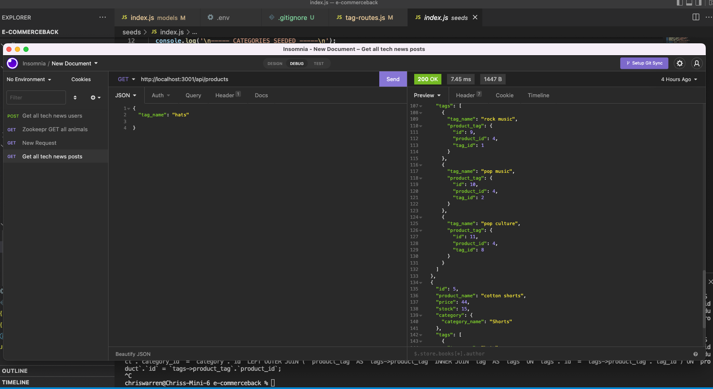

# e-commercebackend

## This repository contains the files that complete the back-end functionality for an e-commerce website

## The started code had much of the architecture already completed.
## The new information is the models for the Category, Tag, Product, and ProductTag objects

## In addition, routes were created for getting all categories, all tags, and all products,
## routes were created to update each object through PUT, to post new objects through POST,
## and routes were created to delete an object using DELETE

### Here are videos of functionality: Had to make two because the video length was over five minutes.
https://watch.screencastify.com/v/i57YW8v6Q8PZI30ojTmA. 

https://watch.screencastify.com/v/p0GEkDLSWQnCpv4SZ8dN

